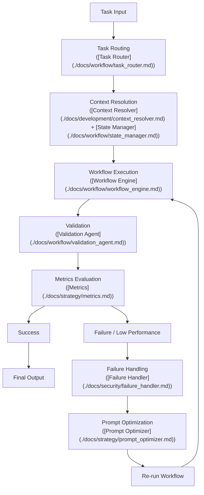
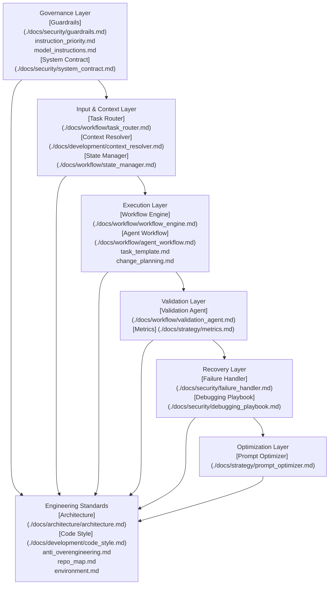

# System Diagram

This document provides a visual and structural overview of how the AI Agent Development System operates.

---

## High-Level Execution Flow



---

## Layered System Architecture



---

## Detailed Workflow Breakdown

### 1. Task Routing

- Classifies task type and complexity
- Determines required execution path

### 2. Context Resolution

- Resolves conflicting inputs
- Prioritizes authoritative context
- Loads active system state

### 3. Workflow Execution

The system enforces a structured execution sequence:

```plaintext
Architect -> Critic -> Builder -> Validator -> Metrics
```

- No steps may be skipped
- Each stage produces structured output

### 4. Validation & Metrics

- Ensures correctness and completeness
- Assigns quality score
- Determines if output is acceptable

### 5. Failure Handling

Triggered when:

- validation fails
- metrics are below threshold
- context is incorrect

Actions:

- classify failure
- apply correction strategy
- re-run workflow

### 6. Optimization Loop

- Refines prompts and execution inputs
- Improves clarity and constraints
- Reduces repeated failures

## System Guarantees

The system guarantees:

- deterministic execution flow
- explicit context resolution
- validated outputs before delivery
- measurable performance
- structured failure recovery

## System Boundaries

The system will not:

- execute ambiguous instructions
- bypass validation
- ignore constraints or guardrails
- produce unverified outputs

## Final Note

This system is not linear.

It is a **controlled feedback loop** designed to:

- execute tasks correctly
- detect failures
- improve continuously
- maintain reliability at scale
